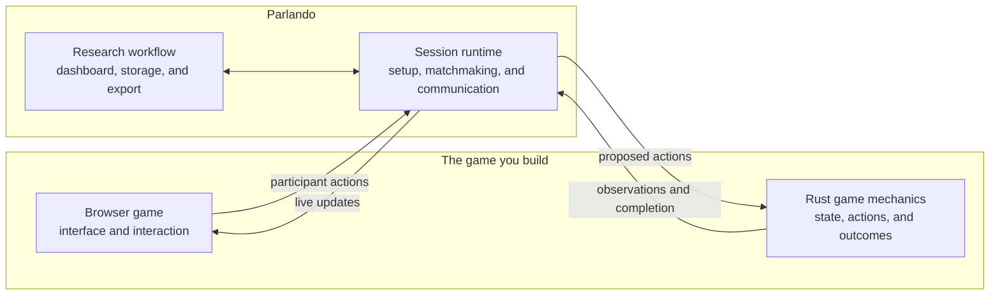

# Parlando

Parlando is a platform for running online dialogue-game experiments. A dialogue
game is a shared task in which two players must communicate while they act in a
changing environment—for example, a map task, reference game, negotiation,
collaborative puzzle, or asymmetric-information problem.

You build the game your research requires: the complete participant-facing web
application as well as the task mechanics behind it. The interface can be a map,
board, simulated world, set of cards, chat-centered task, or any other browser
experience. Parlando provides the surrounding research infrastructure:
participant setup, consent, matchmaking, live communication, agents, data
collection, privacy controls, monitoring, and export.

## Features

- Freedom to build a purpose-designed browser game with custom layouts, controls,
  visualizations, instructions, animations, and audio.
- Two-player browser sessions with server-assigned roles, waiting rooms,
  readiness, and reconnection.
- A typed connection between the browser game and its Rust game mechanics,
  including actions, player-specific observations, and game-specific completion data.
- Human–human and human–agent conditions that use the same game rules and data
  model.
- Typed chat and optional live voice, server-side Speechmatics transcription,
  and ElevenLabs speech synthesis.
- SQLite storage for experiment configuration, consent evidence, participants,
  sessions, actions, messages, transcripts, agent behavior, and outcomes.
- An authenticated experimenter dashboard for configuring experiments, opening
  and closing participant intake, monitoring sessions, deleting participant data,
  and downloading exports.
- Privacy-conscious collection with configurable storage, pseudonymous research
  identifiers, participant-data deletion, and purpose-specific exports.

## Try the example game

The repository includes Space Game, a two-player task in which participants move
through a space station and coordinate repairs. It demonstrates private
information, typed actions, chat, voice, agents, completion, and export.

### Requirements

- a current stable Rust toolchain;
- Node.js 20.19 or newer, or Node.js 22.12 or newer;
- npm; and
- GNU Make.

### Run it

From the repository root:

```sh
make -C space-game run
```

The first run builds the Rust server, the shared JavaScript client, and the Space
Game browser application. When the server is ready:

1. Open [http://127.0.0.1:8000/admin](http://127.0.0.1:8000/admin).
2. Create an administrator account for the local database.
3. Select the starter experiment and configure it in the dashboard.
4. Activate the experiment to open participant intake.
5. Open the participant link shown by the dashboard in two browser windows.

The two participants enter the same waiting pool, receive roles `A` and `B`, and
start when both are ready. Their actions and messages appear in the dashboard and
in the experiment export.


Run the server test suite with:

```sh
cargo test --manifest-path rust-server/Cargo.toml
```

## Build any dialogue game

A Parlando game combines two components that you design. The **browser game** is
everything participants see and use. The **game mechanics** define how the task
behaves. Parlando connects them and supplies the services that are common across
experiments.



### Design the participant experience

The participant application is a first-class part of the experiment, not a fixed Parlando screen.
You decide what the world looks like and how each role's observation is presented, how participants
act, and how progress and completion are presented. A client might render a
spatial environment, a card table, a document, a dialogue interface, or a custom
interactive visualization. It can use ordinary web technologies and any
game-specific assets or interaction design the study needs.

The reusable `@coli-saar/parlando-client` package handles the connection to
Parlando. Its React components can provide the standard setup sequence—participant
information, consent, microphone preparation, matchmaking, and readiness—before
handing control to your game UI. The client then receives player-specific observations
after accepted transitions and sends typed actions. For lower-level control, a client can use the
[documented HTTP and WebSocket protocol](docs/client-protocol.md) directly.

### Implement the mechanics

The Rust side defines the task semantics that all participants and agents share.
Its `Game` implementation specifies:

- the complete game state;
- the actions that participants and agents may propose;
- the observation visible to each role;
- validation and state transitions;
- optional role-neutral metadata stored for analysis; and
- the structured completion produced when a session ends.

This division does not constrain what the browser game can be. It gives the experiment
one consistent implementation of the rules and lets the game send a different
observation to each role when the task contains private information.

Start with [Building a Game](docs/building-games.md), or use the included
`generate-parlando-game` skill to generate a game crate and React client from a
task description. To upgrade an existing 0.2 game, follow [Migrate a Parlando
Game from 0.2 to 0.3](docs/migrating-0.2-to-0.3.md). The Space Game
implementation in `space-game/server` and `space-game/client` is a complete
reference.

### Configure the experiments

Once the game server is running, create experiments in `/admin/experiments`. An
experiment selects participant information and consent text, participant mode, agent, voice,
transcription, speech synthesis, and data-storage settings. Configuration is
stored in SQLite, and each save creates a numbered revision.

The dashboard can host several experiments for the same game. Each experiment
has its own participant link, intake status, waiting rooms, live sessions, and
exports. You can clone an experiment to create a new condition without changing
the original.

Parlando records the game version and configuration revision used for every
session. If you rebuild the game with a new version, clone an earlier experiment
before running it with the new code. Historical sessions remain attached to the
version that produced them.

## Participant workflow

For a typical direct study, a participant:

1. opens the experiment-specific link;
2. reads the study information and submits any required consent declarations;
3. prepares the microphone if voice is enabled;
4. enters the server-managed waiting room;
5. plays from the observation assigned to role `A` or `B`; and
6. receives the game-specific completion screen when the task ends.

The public participant endpoint does not integrate with recruitment platforms by
itself. A study that uses Prolific, MTurk, or another recruitment provider must add
a server-controlled integration that maps recruitment identities to Parlando
participants.

## Agents and voice

An agent occupies one of the same player roles as a human. Its proposed actions
pass through the normal game validation and persistence path. Simple agents can
run inside the Rust game server; Python and other external agents can connect over
gRPC. See [Agents](docs/agents.md).

Headless agent-agent experiments use the same game and agent implementations
without starting the browser runtime or writing live-session rows. A compiled
game registers its factories with `ExperimentRunner` and supplies a small CLI.
For example, run the checked-in Great Tree smoke experiment from the repository
root:

```sh
cargo run --manifest-path games/great-tree/server/Cargo.toml \
  --bin agent_experiment -- \
  games/great-tree/agent-experiment.example.yaml
```

The strict YAML file specifies scenarios, independently assigned agents,
activation policy, limits, concurrency, and output. A run manifest owns one
`run_id`; every expanded scenario/repetition/role assignment has a deterministic
`plan_id`. Repeating the command resumes the same run and skips every finalized
plan, including failed sessions. Headless runs do not receive the dashboard's
three-word live-session identifiers.

Training uses the same YAML agent definitions and session driver. An agent may
add an opaque `checkpoint`; a `training` section names that learner, its scenario
set, seats, epoch/checkpoint cadence, and a registered reward function. An
optional `validation` section supplies held-out scenarios and a checkpoint
cadence. The compiled registry—not a YAML `kind` field—determines whether the
selected factory supports `RLAgent`. Learners own observation/action encoding
and checkpoint storage; the runner records role-safe trajectories and resumes
from atomic checkpoint records without repeating finalized updates. The complete
schema and design are in `notes/agent-agent-runner-design.md`.

Voice-enabled browsers connect only to Parlando and never receive credentials for
speech providers. Parlando relays authenticated 24 kHz PCM audio to the other
player, may stream it to Speechmatics for transcription, and sends synthesized
agent speech back through the same connection. See [Audio
Transport](docs/audio-transport.md).

## Privacy-conscious data and export

Privacy controls are part of the study workflow from participant entry through
publication. Parlando records consent evidence, keeps participant credentials
out of URLs and browser persistence, assigns experiment-scoped pseudonyms, and
supports confirmed participant-data deletion. Experimenters can independently
choose whether to store full game state, typed messages, final transcripts, and
minimized voice diagnostics.

Parlando does not persist raw microphone audio. If transcription is enabled, it
streams audio to the configured service and can retain the resulting final text
only when the experiment permits transcript storage. The administrator privacy
page reports the effective storage choices, external speech services, consent
settings, deletion support, and export capabilities for the installation.

The resulting SQLite record preserves the order and provenance needed for
research while limiting unnecessary data. It can contain actions, selected state
changes, messages, transcripts, agent events, completion summaries, and minimized
voice diagnostics according to the experiment's settings.

The dashboard offers three export variants:

- `research` for normal pseudonymous analysis;
- `corpus` for preparing a publication candidate without internal identifiers or
  absolute timestamps; and
- `full` for restricted administration and audit.

The `research` and `corpus` projections use explicit, stable schemas, so new
internal database fields do not silently enter them. A corpus export is labelled
as a publication candidate because no software can guarantee that free dialogue
contains no identifying remarks. The final release step is therefore a focused
review of participant-authored text and any external recruitment mapping. See
[Data and Monitoring](docs/data-and-monitoring.md) for the complete privacy model,
export boundaries, and participant-deletion behavior.

## How Parlando is organized

One running Parlando server contains one compiled game—its browser application
and Rust mechanics—and a catalogue of experiments using that game. A session is
one play-through within one experiment. This separation lets researchers create
new conditions in the dashboard while keeping the exact game implementation and
version explicit.

The repository is divided accordingly:

- `rust-server`: reusable Rust runtime, persistence, administration, audio, and
  agent infrastructure;
- `js-client`: reusable TypeScript client and React startup components;
- `space-game/server`: example game state, adapter, agents, and server binary;
- `space-game/client`: example participant interface; and
- `rust-server/python/parlando-agent-sdk`: SDK for external Python agents.

## Current scope

- Games currently use two active roles, `A` and `B`.
- SQLite is the implemented durable store.
- Different compiled games run as separate server processes and should use
  separate databases.
- Every server restart closes participant intake until an administrator activates
  an experiment again.
- Deactivating an experiment stops new intake but does not terminate sessions that
  are already running.
- Voice rooms are process-local; multi-replica deployments require sticky routing.

## Documentation

- [Documentation index](docs/README.md)
- [Architecture](docs/architecture.md)
- [Building a Game](docs/building-games.md)
- [Running and Deployment](docs/running-and-deployment.md)
- [Security Ground Rules and Threat Model](docs/security-ground-rules.md)
- [Browser Client Protocol](docs/client-protocol.md)
- [Data and Monitoring](docs/data-and-monitoring.md)
- [Audio Transport](docs/audio-transport.md)
- [Agents](docs/agents.md)
