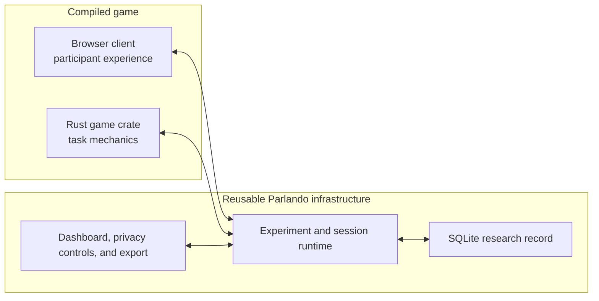

# Architecture

Parlando combines a custom browser experience and custom Rust game mechanics with
reusable experiment infrastructure. Together, the browser client and game crate
form one compiled game. A running process can host several experiments that use
that game.

The compilation boundary gives game authors full control over presentation and
task semantics while keeping experiment creation lightweight. A new condition is
a dashboard configuration rather than a new process; a genuinely different game
is a separate binary with its own client, database, and port.



## Game, experiment, and session

A **game** is the compiled implementation. Its `GameDescriptor` supplies a stable
id, participant-facing name, exact semantic version, and build manifest. The
descriptor belongs to the process and appears prominently in its administrator
dashboard.

An **experiment** is one data-collection configuration for that game. It has a
durable id, lifecycle status, current configuration revision, exact game version,
catalogue metadata, and session aggregates. Experiment configuration is stored in
SQLite and edited through the dashboard. The institution is game-level settings,
because all experiments in the process belong to the same compiled game
installation.

A **session** is one play-through within an experiment. It records the exact game
version and configuration revision selected at creation time, in addition to its
participants, roles, ordered events, messages, transcripts, and completion data.
This provenance remains stable if the experiment is edited later.

The relationship is therefore:

```text
compiled game process
├── shared administrator authentication
├── shared game settings and SQLite catalogue
├── experiment A runtime
│   ├── waiting rooms and live game state
│   ├── participant credentials and WebSocket tickets
│   └── sessions created under revision 3
└── experiment B runtime
    ├── waiting rooms and live game state
    ├── participant credentials and WebSocket tickets
    └── sessions created under revision 1
```

The experiment runtimes share durable installation resources, but not live study
state. A participant credential, room, agent, or ticket from one experiment does
not select or authorize another experiment.

The SQLite database is part of this game-scoped installation boundary. Give each
game binary its own database because Parlando has no cross-game registry that can
partition one database by `GameDescriptor.id`.

## Component responsibilities

The browser client defines the participant experience. Game authors can choose
the layout, visual world, controls, instructions, animations, sounds, and
completion presentation. The client renders observations for the assigned role
and turns participant interaction into typed actions. It can also derive display
state and provide immediate ergonomic feedback; the Rust game crate performs the
final validation shared by browsers and agents.

The game crate defines the study semantics:

- state and action types shared by humans and agents;
- role-specific observations and private-information boundaries;
- action validation and state transitions;
- available-action hints, when useful;
- game-specific events and completion summaries; and
- factories for game-specific agents.

The reusable Parlando runtime supplies mechanisms that should behave consistently
across studies:

- experiment catalogue, immutable configuration revisions, and lifecycle;
- participant creation, consent evidence, matchmaking, roles, readiness, and
  reconnection;
- HTTP and WebSocket authentication;
- action dispatch, persistence, completion records, transcripts, messages, agent
  events, and diagnostics;
- optional audio relay, server-side transcription, and text-to-speech;
- administrator monitoring, fixed exports, privacy status, and participant-data
  deletion.

The SQLite store owns the research record. Browser-local state and in-memory room
state help run a live session; exports are reconstructed from persisted rows.

## Configuration boundaries

Configuration is divided according to when it is needed.

**Process bootstrap** contains values required before the dashboard can open:
listener host and port, database URL, client-build path, and provider credentials.
These values are not experiment fields and are not stored in experiment revisions.

**Game settings** currently contain the institution shared by the process. They
have their own optimistic-concurrency revision.

**Experiment configuration** contains study name, consent, matchmaking, agent,
voice, transcription, TTS, conversation, and privacy settings. Each successful
save creates a new immutable revision. The dashboard provides structured
controls, and Rust deserialization and semantic validation provide a final
consistency check before saving.

Provider API keys remain process secrets. They are neither displayed in the
dashboard nor written to experiment configuration or exports.

## Version boundary

An experiment can activate only when its stored game version exactly matches the
compiled `GameDescriptor.version`. Parlando does not maintain a compatibility
matrix between versions.

To run an earlier configuration with new game code, clone the old experiment. The
clone copies and validates the configuration, receives a new id, and is bound to
the current game version. The source experiment and its historical sessions remain
unchanged. If an old configuration no longer validates under the current types,
the clone request fails and the experimenter must adapt the configuration
explicitly.

## Participant routing

The experiment id is part of the route, not the request body:

```text
/e/{experiment_id}/
/e/{experiment_id}/api/participants
/e/{experiment_id}/api/rooms
/e/{experiment_id}/ws/game/{room_id}
/e/{experiment_id}/ws/audio/{room_id}
```

The JavaScript client derives API and WebSocket locations from the participant
page. Session plans return relative WebSocket paths, so separate game processes
need only distinct origins or ports; no external-URL bootstrap option is required.

## Session flow

A normal human–human session proceeds as follows:

1. The participant opens `/e/{experiment_id}/` and reads public configuration.
2. The active experiment issues a participant credential. Required consent
   declarations are recorded before room entry.
3. Parlando matchmaking assigns roles `A` and `B`.
4. The authenticated browser requests a one-use game ticket and connects to the
   experiment-scoped game WebSocket returned by the server.
5. Once the required participants and audio setup are ready, the server sends
   role-specific observations.
6. Each submitted action is authenticated, deserialized, validated by the game
   adapter, applied, and persisted before targeted updates are broadcast.
7. When `is_complete` becomes true, the server records and broadcasts the
   game-specific completion summary.

Human–agent sessions use the same action and persistence path. The server creates
the agent participant and the game-specific factory supplies its policy.

When voice is enabled, each human opens one experiment-scoped audio WebSocket.
Parlando relays fixed PCM frames to the partner and independently offers them to a
server-side transcription provider. Final transcripts enter the same conversation
and agent-observation path as typed messages. Agent TTS returns through the audio
relay and is not transcribed again. See [Audio Transport](audio-transport.md).

## Failure and restart behavior

A process failure affects every active experiment for that compiled game. Sharing
one process keeps operation simple at the intended academic deployment scale: no
per-experiment process supervisor or stale-process cleanup is required. The
corresponding cost is a shared failure boundary for that game.

On every start, the process resets all experiments to `inactive`. Process health
therefore does not imply open participant intake. Deactivation rejects new
participants and room entry but leaves established sessions connected. It is not
an emergency session-termination mechanism.

## Worked implementation

- `space-game/server/src/game/state_engine.rs`: state, actions, observations,
  events, and completion.
- `space-game/server/src/game/adapter.rs`: `GameAdapter` implementation.
- `space-game/server/src/agents.rs`: in-process and remote-agent factories.
- `space-game/server/src/main.rs`: descriptor and process bootstrap.
- `space-game/client`: participant UI using `@coli-saar/parlando-client`.
