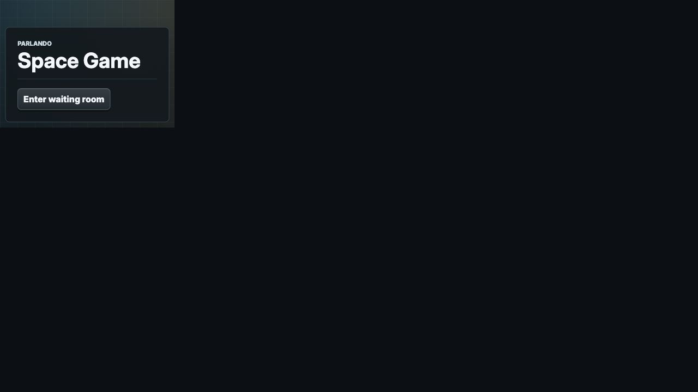
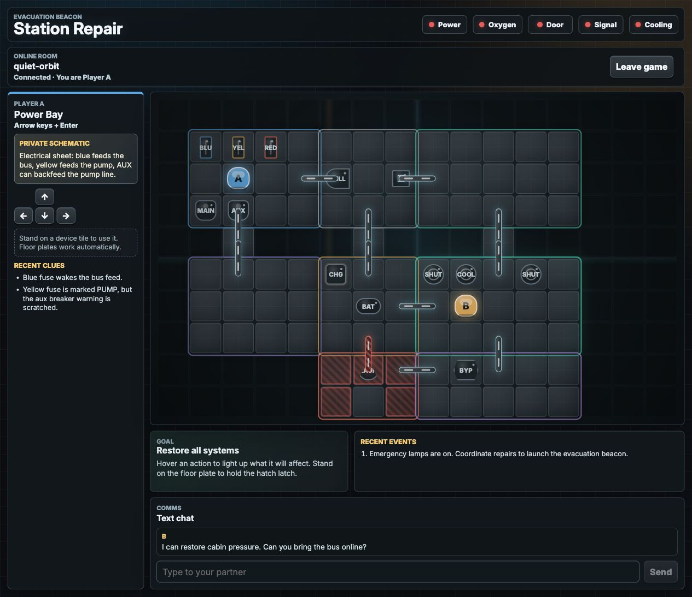

# Browser client protocol

The browser client is where the game becomes a participant experience. It can use
the full range of browser technologies for custom rendering and interaction;
Parlando only requires a small typed exchange of game values. A game author
therefore designs both sides together:

- Rust structs and enums define the state, action, observation, event, and
  summary used by the game mechanics.
- Serde attributes define the wire names.
- TypeScript types should mirror the JSON shape, not necessarily the Rust field names.
- The React or plain JavaScript UI renders observations and sends action JSON back to the server.

The reusable `@coli-saar/parlando-client` package supplies HTTP helpers,
WebSocket helpers, audio-session helpers, and generic protocol types. The game
client supplies the visual design, interaction model, game-specific types,
assets, instructions, and completion presentation.

A useful mental model is: build the participant experience from `observation`,
send proposed actions through the socket, and use client-side state freely for
presentation. The Rust mechanics make the final decision about whether an action
is legal and which information belongs in each role's observation. This keeps
browsers and agents consistent without limiting the form of the interface.

## Match Rust and JSON names

Rust structs commonly use snake_case fields. The JSON wire format follows serde rules:

- a field without `#[serde(rename = "...")]` keeps its Rust field name.
- `#[serde(rename = "someName")]` uses that exact JSON key.
- `#[serde(rename_all = "camelCase")]` converts all fields in that struct or enum variant.
- enum variants with `#[serde(tag = "type")]` serialize as JSON objects with a `type` discriminator.

Example Rust action:

```rust
#[derive(Clone, Debug, serde::Deserialize, serde::Serialize)]
#[serde(tag = "type")]
pub enum SpaceAction {
    #[serde(rename = "moveStep")]
    MoveStep { player: String, direction: String },
    #[serde(rename = "setValve")]
    SetValve {
        player: String,
        valve: String,
        open: bool,
    },
}
```

Matching JSON actions:

```json
{ "type": "moveStep", "player": "A", "direction": "left" }
```

```json
{ "type": "setValve", "player": "B", "valve": "C", "open": true }
```

Matching TypeScript type:

```ts
type GameAction =
  | { type: "moveStep"; player: "A" | "B"; direction: "up" | "down" | "left" | "right" }
  | { type: "setValve"; player: "A" | "B"; valve: "A" | "C" | "floodgate"; open: boolean };
```

If a Rust field is renamed, mirror the renamed JSON field in TypeScript. For example, the demo game uses Rust field `override_held` with `#[serde(rename = "overrideHeld")]`; the TypeScript field is `overrideHeld`.

Two additional details matter in browser code:

- Rust integer and floating-point values both arrive as JavaScript `number` values.
- fields annotated with `skip_serializing_if = "Option::is_none"` are omitted when absent; fields without that annotation may appear as `null`.

Write UI code that handles both omitted optional properties and explicit `null` when a reusable protocol type allows it.

## Guide the participant into the game

Every participant page is rooted at `/e/{experiment_id}/`. The SDK derives this
prefix from `window.location.pathname`, so the game client should use its helpers
instead of constructing unscoped URLs. In the sequence below, `{base}` means
`/e/{experiment_id}`.

A typical browser flow is:

1. `GET {base}/api/config` to read public study settings, lifecycle, consent text, and enabled audio features. When `experiment_status` is `inactive`, do not attempt participant or room creation; the shared startup gate renders the closed-intake state.
2. `POST {base}/api/participants` to create a participant session and receive an opaque bearer credential.
3. Send that credential as `Authorization: Bearer ...` on participant-owned calls such as `POST {base}/api/consent`.
4. `POST {base}/api/rooms` with the participant bearer credential. The server pairs compatible waiting participants or creates a waiting room; callers do not choose room ids or matchmaking modes.
5. `POST {base}/api/rooms/{room_id}/audio-session` if voice is enabled.
6. `POST {base}/api/rooms/{room_id}/game-session`, then connect to the returned relative WebSocket path with its short-lived one-use `token` query value.
7. Wait for `roleAssigned` before showing active game controls.

The reusable JavaScript client wraps these HTTP calls. The game UI still decides
how to arrange the screens, explain the task, present waiting and readiness, and
move into active play. For most React games, `ParlandoStartupGate` provides the
standard lifecycle while allowing the active game screen to remain entirely
custom.

The shared startup screen is deliberately compact:



After setup, the custom game client controls the participant experience:



The participant-creation response separates three concepts:

```ts
interface ParticipantCreateResponse {
  participant_session_id: string; // non-secret runtime handle
  participant_credential: string; // bearer credential; keep out of URLs and logs
  source: "direct";
  participant_id: string; // readable random identifier scoped to this experiment
}
```

The same recruited person receives a different `participant_id` in another experiment. Within one experiment, the identifier remains unchanged across administration views and repeated research or corpus exports.

## HTTP Room Payloads

Room creation and joining responses include game-specific payloads:

```ts
interface RoomResponse<TState, TObservation, TAction, TEvent> {
  room_id: string;
  participant_session_id: string;
  role: "A" | "B" | string;
  state?: TState | null;
  observation?: TObservation | null;
  available_actions?: TAction[];
  events?: TEvent[];
  conversation?: ConversationMessage[];
}
```

Use `observation` for the participant view. `state` may be present for
compatibility or administration-like flows; the role-specific observation is the
intentional client contract and contains the fields the game author chose for
that participant.

For waiting-room flows, room responses omit game payloads while the room is still waiting. The game starts when the WebSocket receives `roleAssigned`.

`available_actions` has three different states:

- omitted or `null`: the game does not provide this affordance in that payload.
- `[]`: the game provides the affordance and this player currently has no listed actions.
- `[ ... ]`: the game provides concrete action objects that the UI may render as controls.

The server still validates every submitted action, including actions selected from `available_actions`.

## WebSocket Messages

After setup, mint a one-use upgrade plan and open the room socket with:

```ts
const plan = await apiClient.getGameSession(roomId);
const socket = new WebSocket(apiClient.socketUrl(plan));
```

The returned URL shape is:

```text
/e/{experiment_id}/ws/game/{room_id}?token={one_use_game_ticket}
```

The public participant identifier is never accepted as authentication. The SDK retains the participant credential in memory and does not put it in browser history, `localStorage`, presence, or export payloads.

### `roleAssigned`

This is the game-start or reconnect payload for a participant:

```json
{
  "type": "roleAssigned",
  "room_id": "room-123",
  "participant_session_id": "participant-session-abc",
  "role": "A",
  "observation": {
    "role": "A",
    "players": {
      "A": { "room": "power", "position": { "x": 2, "y": 2 }, "plateHeld": false },
      "B": { "room": "valve", "position": { "x": 9, "y": 6 }, "plateHeld": false }
    },
    "privateKnowledge": ["Blue fuse wakes the bus feed."],
    "systems": { "readyToLaunch": false }
  },
  "available_actions": [
    { "type": "moveStep", "player": "A", "direction": "left" }
  ],
  "events": [],
  "conversation": []
}
```

`roleAssigned` is not just an acknowledgement. It is the first game-state payload that should move the UI from waiting/setup into active play.

### `stateChanged`

This is sent after an accepted action:

```json
{
  "type": "stateChanged",
  "room_id": "room-123",
  "observation": { "...": "role-specific observation" },
  "available_actions": [
    { "type": "runDiagnostic", "player": "A" }
  ],
  "events": [
    { "type": "action", "actor": "A", "text": "You run diagnostics." }
  ],
  "conversation": []
}
```

Render the new `observation`, update controls from `available_actions` if the game provides them, and append any `events` to the local activity log.

### Other Server Messages

```ts
type ServerMessage<TState, TObservation, TAction, TEvent> =
  | { type: "roleAssigned"; room_id: string; participant_session_id: string; role: string; state?: TState | null; observation?: TObservation | null; available_actions?: TAction[]; events?: TEvent[]; conversation?: ConversationMessage[] }
  | { type: "stateChanged"; room_id: string; state?: TState | null; observation?: TObservation | null; available_actions?: TAction[]; events?: TEvent[]; conversation?: ConversationMessage[] }
  | { type: "conversationMessageAdded"; room_id: string; conversation_message: ConversationMessage }
  | { type: "completed"; room_id: string; summary: Record<string, unknown> }
  | { type: "presenceChanged"; room_id?: string; presence?: Record<string, unknown> }
  | { type: "voiceStatusChanged"; room_id?: string; voice?: { audioReady?: boolean; transcriptionReady?: boolean; transcriptionStatus?: string } }
  | { type: "partnerWaiting"; room_id?: string; message?: string }
  | { type: "error"; room_id?: string; message?: string };
```

`conversationMessageAdded` is the live chat/voice transcript path. `completed` carries the game-specific completion summary returned by `completion_summary`.

## Sending Actions

The browser submits a game action over the room socket:

```json
{
  "type": "submitAction",
  "action": { "type": "moveStep", "player": "A", "direction": "left" }
}
```

With `@coli-saar/parlando-client`:

```ts
apiClient.sendAction(socket, {
  type: "moveStep",
  player: assignedRole,
  direction: "left"
});
```

The client can disable or explain unavailable actions immediately. The server
also parses `action` into the Rust `Action` type and calls `validate_action`, so
the same rules apply to browsers, reconnecting clients, and agents.

## Sending Chat

Text chat uses:

```json
{
  "type": "sendChatMessage",
  "text": "Try the blue fuse first."
}
```

The server broadcasts `conversationMessageAdded`. It also persists the message as a conversation event when `privacy.store_typed_messages` is enabled.

## TypeScript Mirror Types

For each game, define TypeScript types that mirror the JSON shapes. The demo game uses:

```ts
export type GameAction =
  | { type: "moveStep"; player: PlayerId; direction: Direction }
  | { type: "toggleFuse"; player: PlayerId; color: FuseColor }
  | { type: "launchBeacon"; player: PlayerId }
  | { type: "reset" };

export interface StationObservation {
  players: Record<PlayerId, PlayerState>;
  fuses: Record<FuseColor, boolean>;
  systems?: DerivedSystems;
  role?: PlayerId;
  privateKnowledge?: string[];
}

type GameServerMessage =
  ServerMessage<StationState, StationObservation, GameAction, ObservationEvent>;
```

Keep the TypeScript type in sync with serde output. If you rename a Rust field or enum variant, update the TypeScript type and UI code at the same time.

Recommended source layout for a game client:

- `game/types.ts`: TypeScript mirror types for action, observation, events, summary, and any UI-only helper types.
- `game/stateEngine.ts`: optional client-side helpers for deriving labels, possible controls, or purely visual effects from observations.
- `App.tsx` or equivalent: setup flow, WebSocket lifecycle, rendering, and action dispatch.

Client-side checks provide immediate feedback and can be as rich as the game
requires. Keep `validate_action` complete as well, so every participant and agent
uses the same final rule set.

## Browser Implementation Checklist

For a new game client, implement:

1. TypeScript mirror types for `Action`, `Observation`, `Event`, and `Summary`.
2. Participant setup through the SDK, which scopes configuration, participant, consent, and room calls to the experiment in the page URL.
3. An authenticated request to `{base}/api/rooms/{room_id}/game-session`, followed by a WebSocket connection to the experiment-scoped relative path returned with the one-use ticket.
4. Handling for `roleAssigned`, `stateChanged`, `conversationMessageAdded`, `completed`, `presenceChanged`, `voiceStatusChanged`, and `error`.
5. Rendering from `observation`, not from hidden server state.
6. Action controls that send `{ type: "submitAction", action }`.
7. Chat controls that send `{ type: "sendChatMessage", text }` if conversation is enabled.
8. Audio-session setup through `{base}/api/rooms/{room_id}/audio-session` if voice is enabled.
9. Local UI state for transient display concerns such as selected panels,
   animations, scroll position, and unsubmitted text.

## Audio Transport

`POST {base}/api/rooms/{room_id}/audio-session` uses the bearer credential and returns a short-lived plan:

```json
{
  "enabled": true,
  "websocket_url": "/e/pilot/ws/audio/room-123",
  "token": "short-lived-room-token",
  "protocol_version": 1,
  "sample_rate_hz": 24000,
  "channels": 1,
  "frame_duration_ms": 20,
  "jitter_buffer_ms": 100
}
```

Connect to `websocket_url` with the opaque, one-use `token` as a query parameter. Each binary message is exactly 973 bytes: one version byte (`1`), a big-endian `u32` sequence number, a big-endian `u64` capture timestamp in milliseconds, then 960 bytes of little-endian PCM16 mono audio. The server validates each frame, relays it to the other player, and independently offers it to the configured server-side transcription provider.

The server may send JSON text control messages on the same socket:

```json
{"type":"transcriptionStatus","ready":true,"message":"ASR listening"}
```

Audio returned by the socket has the same binary frame format and may originate from the partner or server-generated agent TTS. Provider partials are status-only. Final utterances arrive on the game socket as ordinary `conversationMessageAdded` messages with origin `voice_transcript`; the browser never posts transcript text and never receives an STT credential.

The SDK buffers the configured `jitter_buffer_ms` before initial playback,
resamples with linear interpolation, and reports `audio_playback_underrun`
diagnostics. Server-generated TTS prebuffers that window and then uses absolute
20 ms send deadlines. For most games, `ParlandoStartupGate` should own pacing and
the playback queue. See [Audio Transport](audio-transport.md) for operational and
privacy details.

## External References

- [Serde attributes](https://serde.rs/attributes.html) for Rust JSON naming and tagging.
- [TypeScript unions](https://www.typescriptlang.org/docs/handbook/2/everyday-types.html#union-types) for action and message discriminators.
- [MDN WebSocket API](https://developer.mozilla.org/en-US/docs/Web/API/WebSocket) for browser socket behavior.
