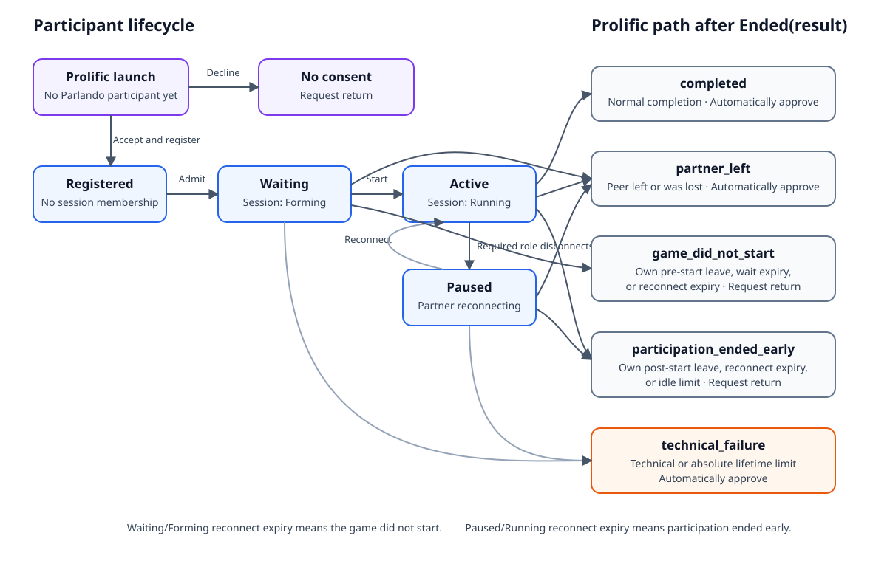

# Prolific integration

This document is a technical reference for maintainers and deployment operators. Experimenters who
want to configure and run a study should follow
[Run a Parlando experiment through Prolific](using-prolific.md).

Parlando verifies each Prolific admission, pairs Prolific participants without changing their
recruitment source, records phase-specific outcomes, and returns each participant through the
appropriate Prolific completion path. Parlando never calculates compensation or sends bonus
payments. Researchers review factual session records in Parlando and perform any payment-related
work in Prolific.

## Mental model

One dyadic Parlando game contains two Prolific submissions. Each participant therefore has their
own `PROLIFIC_PID` and `SESSION_ID`; both share the configured `STUDY_ID`. The Parlando game has a
separate session identifier and assigns the two verified participants roles A and B.

Parlando records nine factual participant outcomes and maps terminal results onto six
researcher-configured Prolific completion paths. The participant outcome remains the factual
record; the completion path controls provider processing.

| Parlando outcome | Meaning | Prolific path | Required Prolific action |
|---|---|---|---|
| `completed` | The game completed normally. | Completed | Automatically approve |
| `left_waiting_room` | The participant actively left before a playable game began. | Game did not start | Request return |
| `left_game` | The participant actively left after the game began. | Participation ended before completion | Request return |
| `connection_lost` | This participant disconnected and did not reconnect in time. Before game start this maps to Game did not start; after game start it maps to Participation ended before completion. | Phase-dependent | Request return |
| `partner_left` | The participant remained while the partner left or failed to reconnect. | Partner left | Automatically approve |
| `partner_unavailable` | No partner was found before the waiting deadline. | Game did not start | Request return |
| `idle_limit_reached` | The running game produced no accepted message or action before its idle deadline. | Participation ended before completion | Request return |
| `technical_failure` | Parlando could not continue the session safely. | Technical failure | Automatically approve |
| `lifetime_limit_reached` | The absolute infrastructure lifetime ended an otherwise live game. | Technical failure | Automatically approve |

Declining consent is a pre-registration route rather than a participant outcome. It uses Prolific's
built-in **No consent** path with **Request return** and creates no Parlando participant record.

The values configured in Parlando are the exact completion codes created in Prolific. All six
codes must be present and distinct.

## Configure the installation

An administrator configures two installation-level values in the Parlando dashboard:

1. Store a Prolific API token under **Provider secrets**.
2. Keep **Prolific API base URL** at `https://api.prolific.com` for real studies. A compatible
   loopback emulator may use a local HTTP origin during integration testing.

The token may grant access to more than one workspace. Parlando therefore does not bind the
installation to a workspace. It derives the workspace of each linked study from that study's
project. The token is stored as a protected server-side secret and is never written into experiment
configuration or returned to the browser.

## Create and link the Prolific study

Each Prolific-enabled Parlando experiment corresponds to one Prolific study. The workspace
connection grants API access, but it does not select a study.

Open the inactive experiment in Parlando and go to **Configuration → Prolific study and completion
paths**. Copy **URL for Prolific study setup** into the external-study URL field of a new Prolific
study. This URL is available before the Parlando experiment starts and contains Prolific's literal
`{}`, `{}`, and `{}` placeholders. It admits participants
only after the corresponding provider-backed Parlando run starts.

Create six completion codes in Prolific before activating the Parlando experiment:

1. Completed — **Automatically approve**.
2. Partner left — **Automatically approve**.
3. Game did not start — **Request return**.
4. Participation ended before completion — **Request return**.
5. Technical failure — **Automatically approve**.
6. Prolific's built-in No consent path — **Request return**.

The Game did not start path must be an ordinary custom completion code with **Request return**. Do
not use a screen-out action. A returned submission remains visible in Prolific, where the researcher
can apply the study's payment policy. Parlando does not create a payment queue, calculate a waiting
amount, or call a bonus endpoint.

Return to Parlando, enable Prolific intake, enter the new study's exact ID, and copy the six codes
into their corresponding fields. Saving the experiment configuration retrieves the study and its
project. Parlando retains a structurally valid revision even when this provider check reports a
problem, so the exact draft remains available for correction. Test through Prolific and Official
intake remain unavailable until the project supplies a workspace, the study uses the displayed URL,
and the required completion paths are present.

Enable Prolific's **Secure external URL** for the study. Prolific then adds a short-lived signed
`prolific_token` query parameter. Parlando verifies its signature, issuer, audience, expiry, study,
workspace, participant, and submission before admitting the participant. The browser removes this
token and the provider identifiers from the visible URL after intake.

See Prolific's current [study API and Secure external URL contract](https://docs.prolific.com/api-reference/studies/create-study)
and [JWKS endpoint guidance](https://docs.prolific.com/api-reference/well-known-endpoints/get-study-jwks).

If Secure external URL is unavailable for a particular study, Parlando performs the narrower
fallback verification by retrieving the claimed submission from the Prolific API and checking that
its participant and study match. The fallback is not an unchecked query-parameter mode.

## Study validation

When the researcher saves the experiment, Parlando retrieves the linked study from Prolific and checks:

- the study has a project from which its workspace can be derived;
- its external URL exactly equals the server-generated setup template for this Parlando experiment;
- the six configured codes exist with exactly the required actions;
- the Game did not start code is not a screen-out path;
- the Prolific estimated completion time is compatible with the Parlando game limit; and
- the Prolific maximum time is compatible with Parlando's maximum session lifetime.

The saved draft and the provider-readiness result are separate: a failed check does not discard the
revision. The provider-backed run badges show the specific issues and become green only when Start
can use a verified result. Local Preview does not contact Prolific.

The setup template is generated on the server from the configured public installation origin and
the experiment ID. The dashboard displays that authoritative value even when an administrator uses
an internal hostname or a different allowed origin. Public installation URLs are origin-only;
remote Prolific intake requires HTTPS, while loopback HTTP remains available to the integration
fixture.

## What participants see

### Waiting for a partner

The waiting-room widget shows the server-owned deadline as a live countdown. It explains that the
participant may leave immediately or wait until the deadline, and that either route produces the
same Game did not start/return handling; the dashboard records the longer wait when the deadline
expires.

The waiting duration is not estimated from browser heartbeats. Parlando stores the server timestamps
`waiting_started_at` and `ended_at` (or the fixed `waiting_deadline_at`) and displays their difference.
Prolific does not learn those minutes automatically from Parlando. A researcher who needs them for a
manual payment reads them in the Parlando session detail and performs the payment in Prolific.

### Running game

The game begins as soon as both required participants are ready. Three independent safeguards apply:

- **Reconnect deadline:** if one participant's game connection disappears, interaction pauses for a
  fixed grace period. A successful reconnect resumes the same session. At expiry, the disconnected
  participant receives `connection_lost`; the participant who remained receives `partner_left`.
  Reconnect expiry before the game starts instead maps the disconnected participant to Game did not
  start because no playable game began.
- **Idle deadline:** only an accepted conversation message or game action advances meaningful
  activity. Heartbeats, connection traffic, and merely leaving a tab open do not count. If no
  meaningful activity occurs before the deadline, each participant receives `idle_limit_reached`,
  which maps to the request-return Participation ended before completion path.
- **Maximum lifetime:** an absolute infrastructure limit prevents a session from running forever.
  Reaching it is treated as a technical failure rather than participant inactivity.

If the Parlando process restarts, any session that was still waiting or running is finalized once as
a technical failure before new intake opens. Its original deadlines and participant assignments are
retained, and returning participants receive the durable Technical failure handoff. Parlando does
not attempt to reconstruct an interrupted real-time game from browser state.

### Terminal handoff

The terminal widget explains the participant's factual outcome and provides the appropriate Prolific
completion link. Each member of a pair receives the result derived for that participant; one partner
leaving never changes the other participant's recruitment source or reuses the leaver's return code.

## Review sessions

The dashboard session list labels game-did-not-start and partner-left sessions explicitly. Session detail
shows:

- waiting start, waiting deadline, and exact unsuccessful waiting duration;
- both A/B assignments and both participants' Prolific identifiers;
- recipient-specific factual outcomes and completion handoffs;
- which participant disconnected or left;
- the reconnect deadline and whether the partner remained; and
- the last meaningful activity time for idle-limit cases.

A participant who reached Parlando's waiting room remains visible even when no match was formed.
Private Prolific correlation can be purged under the configured retention policy without deleting the
non-identifying session outcome or its A/B research record.

## Operational boundary

Parlando may read a submission's current Prolific status, entered code, and return-request state for
reconciliation. It does not approve, reject, return, or pay submissions through the API in this
version. Prolific remains the authority for submission processing and all compensation.

Before opening a paid study, run a pilot with two real submissions and verify activation preflight,
pairing, normal completion, game-did-not-start timeout, partner disconnect, terminal links, and dashboard
facts from both participants' perspectives.

Use [Test the Prolific integration](prolific-testing.md) to run Parlando's local process-boundary
scenario matrix before the live pilot.
